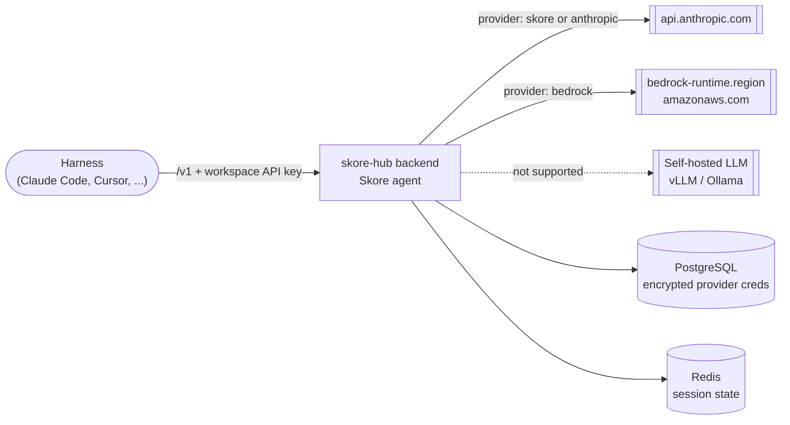

# Agent setup

This document covers the post-install onboarding of the **Skore agent**, the hub-side LLM orchestration exposed to harnesses (Claude Code, OpenCode, Cursor, Pi) as an OpenAI/Anthropic-compatible endpoint on `/v1/chat/completions`, `/v1/messages`, `/v1/models`.

It assumes the backend is already installed ([Installation](01-installation.md#install-the-backend)) and reachable. For the full list of `SKH__AGENT__*` and `SKH__ENCRYPTION__*` settings, see [Configuration reference](reference-configuration.md#skore-agent-agent).

> [!NOTE]
> **Air-gapped notice.** The agent only supports **Anthropic** (SaaS) and **AWS Bedrock** as LLM backends. A deployment with no outbound access to either is **not supported** in this version. See [Deployment models](#deployment-models).

## Contents

- [Prerequisites](#prerequisites)
- [Deployment models](#deployment-models)
- [Bedrock IAM patterns](#bedrock-iam-patterns)
- [Activate the agent on the hub](#activate-the-agent-on-the-hub)
- [Register a workspace LLM provider](#register-a-workspace-llm-provider)
- [Create a workspace API key](#create-a-workspace-api-key)
- [Point a harness at the agent](#point-a-harness-at-the-agent)
- [Verify end to end](#verify-end-to-end)

## Prerequisites

Before a workspace can use the agent:

1. **Migrations applied.** The `agent_workspace_provider_config` table is created by the standard Alembic migration Job run on every Helm install/upgrade ([Install the backend](01-installation.md#install-the-backend)). No extra step.

2. **Encryption key set.** `SKH__ENCRYPTION__KEY` (Fernet) is **required** for workspaces to store their own provider credentials (Anthropic API keys, AWS/Bedrock keys, STS external ids) encrypted at rest. Generate one:

   ```bash
   python -c "from cryptography.fernet import Fernet; print(Fernet.generate_key().decode())"
   ```

   Store it in the `skore-hub-backend-secrets` Secret under the `encryption-key` key and reference it via `skh.extraEnv` ([Secrets](01-installation.md#secrets)). Do not rotate it without re-encrypting stored secrets ([Operations](02-operations.md#skore-agent-operations)).

3. **Network egress** to the LLM provider you intend to use ([Skore agent](01-installation.md#skore-agent-optional)):

   - Anthropic: `api.anthropic.com` (443)
   - AWS Bedrock: `bedrock-runtime.<region>.amazonaws.com` (443) and, for assume-role, `sts.amazonaws.com` (443)

4. **Redis** when running more than one backend replica (`SKH__REDIS__IS_ENABLED=true`), so agent session state is shared across pods.

## Deployment models

Pick the model that matches who provides the LLM credentials. All three can coexist on the same hub: the global config sets defaults, and each workspace picks its own provider in the Hub UI.

| Model | Operator provides | Per-workspace | Air-gapped? |
| --- | --- | --- | --- |
| **Skore-managed** | `SKH__AGENT__ANTHROPIC_API_KEY` + `SKH__AGENT__MANAGED_EMAILS` allowlist | None, entitled users select the Skore provider | No (egress to Anthropic) |
| **BYO Anthropic** | `SKH__ENCRYPTION__KEY` (global Anthropic key may stay empty) | Each workspace registers its own Anthropic API key | No (egress to Anthropic) |
| **BYO Bedrock** | AWS credentials or IAM role (see [Bedrock IAM](#bedrock-iam-patterns)) | Each workspace registers AWS creds/role | No (egress to AWS) |
| **Air-gapped** | - | - | **Not supported** in this version (no local LLM backend) |



The dashed edge is the air-gapped case: the hub has no self-hosted LLM backend, so at least one of the two solid egress paths must be reachable.

### Minimal global config by model

The snippets below are TOML — the most readable form — and belong in `skh.config.data` (see [Configuration via ConfigMap (TOML)](01-installation.md#configuration-via-configmap-toml)). TOML takes priority over `SKH__*` env vars, so **omit any secret key** (API keys, the Fernet key) from the TOML and keep it in `skh.extraEnv` (see [Secrets](01-installation.md#secrets)); the env var fills the gap.

**Skore-managed** (operator pays the LLM bill for entitled users):

```toml
[agent]
backend = "anthropic"
provider = "anthropic"
managed_emails = ["*@yourcompany.com"]   # or explicit addresses
# anthropic_api_key stays in skh.extraEnv (Secret), NOT here
```

with the secret mapped from the Secret:

```yaml
skh:
  extraEnv:
    - name: SKH__AGENT__ANTHROPIC_API_KEY
      valueFrom:
        secretKeyRef: { name: skore-hub-backend-secrets, key: anthropic-api-key }
```

**BYO Anthropic** (each workspace brings its own key):

```toml
[agent]
backend = "anthropic"
# anthropic_api_key may stay empty; workspaces use their own
anthropic_models = ["claude-opus-4-8", "claude-sonnet-4-6"]
```

with the Fernet key from the Secret (required so workspaces can store their own keys encrypted):

```yaml
skh:
  extraEnv:
    - name: SKH__ENCRYPTION__KEY
      valueFrom:
        secretKeyRef: { name: skore-hub-backend-secrets, key: encryption-key }
```

**BYO Bedrock** (each workspace brings AWS creds/role):

```toml
[agent]
backend = "anthropic"   # legacy global flag; effective provider comes from the workspace
provider = "bedrock"
aws_region = "us-east-1"
bedrock_model_big = "..."
bedrock_model_normal = "..."
bedrock_model_small = "..."
bedrock_models = ["..."]   # required: workspaces can only pin a model listed here
# Optional global Bedrock creds (ambient chain / IRSA also work):
# bedrock_role_arn = ""
# aws_access_key_id and aws_secret_access_key stay in skh.extraEnv (Secret)
```

with the Fernet key (and any static AWS creds) from the Secret:

```yaml
skh:
  extraEnv:
    - name: SKH__ENCRYPTION__KEY
      valueFrom:
        secretKeyRef: { name: skore-hub-backend-secrets, key: encryption-key }
    # Optional static creds (ambient chain / IRSA also work):
    # - name: SKH__AGENT__AWS_ACCESS_KEY_ID
    #   valueFrom:
    #     secretKeyRef: { name: skore-hub-backend-secrets, key: aws-access-key-id }
    # - name: SKH__AGENT__AWS_SECRET_ACCESS_KEY
    #   valueFrom:
    #     secretKeyRef: { name: skore-hub-backend-secrets, key: aws-secret-access-key }
```

> [!IMPORTANT]
> On Bedrock, only **Anthropic models** are supported in this version. Use cross-region inference profile ids rather than bare foundation-model ids.

## Bedrock IAM patterns

The hub reads AWS credentials through the standard credential chain. Three patterns cover the common on-prem cases.

### AWS-side prerequisites

These apply to all three patterns and are the most common cause of a provider that registers fine but fails on the first prompt.

**Credential format.** Supported credentials are an access key id with its secret access key, an assumable role, or an instance/pod identity. The short-term **Bedrock API keys** issued by the console (bearer tokens starting with `bedrock-api-key-`) are **not supported**.

**Model access.** Anthropic models on Bedrock require the account to have submitted the *Anthropic use case details* form in the Bedrock console, once per account. Until it is accepted, every call fails with `ResourceNotFoundException: Model use case details have not been submitted for this account`, regardless of IAM permissions. The form is console-only; no API or CLI can submit it, and changes take up to 15 minutes to propagate.

**Policy scope.** Granting `bedrock:InvokeModel` on the inference profile alone is not enough. A cross-region profile forwards the request to the underlying foundation model in whichever region serves it, and that call is authorized separately, so the policy must also cover the foundation model in every region the profile can reach:

```json
{
  "Effect": "Allow",
  "Action": ["bedrock:InvokeModel", "bedrock:InvokeModelWithResponseStream"],
  "Resource": [
    "arn:aws:bedrock:<region>:<account>:inference-profile/<profile-id>",
    "arn:aws:bedrock:*::foundation-model/<foundation-model-id>"
  ]
}
```

### Pattern 1 — IRSA (EKS)

Annotate the chart's ServiceAccount with the IAM role ARN; the chart already mounts that ServiceAccount on the backend pods.

```yaml
serviceAccount:
  create: true
  annotations:
    eks.amazonaws.com/role-arn: arn:aws:iam::<account>:role/skore-hub-bedrock
```

The IAM role must allow `bedrock:InvokeModel` on the target models, with the resource scope described in [AWS-side prerequisites](#aws-side-prerequisites). For cross-account Bedrock, add `sts:AssumeRole` and configure the trust policy of the target role to trust this role.

### Pattern 2 — Static credentials (vanilla on-prem / non-EKS)

Inject the keys through the `skore-hub-backend-secrets` Secret and reference them via `skh.extraEnv`. The non-secret `aws_region` can go in `skh.config.data` (`[agent] aws_region = "us-east-1"`) or `skh.env`:

```yaml
skh:
  extraEnv:
    - name: SKH__AGENT__AWS_ACCESS_KEY_ID
      valueFrom:
        secretKeyRef: { name: skore-hub-backend-secrets, key: aws-access-key-id }
    - name: SKH__AGENT__AWS_SECRET_ACCESS_KEY
      valueFrom:
        secretKeyRef: { name: skore-hub-backend-secrets, key: aws-secret-access-key }
```

### Pattern 3 — Cross-account assume-role

When Bedrock lives in another AWS account, the hub assumes a role there using STS. The non-secret role ARN and region go in `skh.config.data` (`[agent] bedrock_role_arn = "..."`, `aws_region = "..."`) or `skh.env`; the external id is secret and comes from the Secret via `skh.extraEnv`:

```yaml
skh:
  env:
    SKH__AGENT__BEDROCK_ROLE_ARN: "arn:aws:iam::<target-account>:role/bedrock-cross-account"
    SKH__AGENT__AWS_REGION: "us-east-1"
  extraEnv:
    - name: SKH__AGENT__BEDROCK_EXTERNAL_ID
      valueFrom:
        secretKeyRef: { name: skore-hub-backend-secrets, key: bedrock-external-id }
```

The target role's trust policy must allow the caller (the hub's IRSA role or static-key principal) with `sts:AssumeRole` and the configured `ExternalId`. The hub refreshes the assumed credentials automatically.

## Activate the agent on the hub

Set the global agent config on the backend chart. With the Skore-managed model as an example, as TOML (preferred — goes in `skh.config.data`):

```yaml
skh:
  config:
    enabled: true
    data: |
      [agent]
      backend = "anthropic"
      provider = "anthropic"
      managed_emails = ["*@yourcompany.com"]
      model_big = "claude-opus-4-8"
      model_normal = "claude-sonnet-4-6"
      model_small = "claude-haiku-4-5"
  extraEnv:
    - name: SKH__AGENT__ANTHROPIC_API_KEY
      valueFrom:
        secretKeyRef: { name: skore-hub-backend-secrets, key: anthropic-api-key }
    - name: SKH__ENCRYPTION__KEY
      valueFrom:
        secretKeyRef: { name: skore-hub-backend-secrets, key: encryption-key }
```

…or the same settings as env vars (`skh.env`), if you prefer not to mount a TOML file:

```yaml
skh:
  env:
    SKH__AGENT__BACKEND: "anthropic"
    SKH__AGENT__PROVIDER: "anthropic"
    SKH__AGENT__MANAGED_EMAILS: '["*@yourcompany.com"]'
    SKH__AGENT__MODEL_BIG: "claude-opus-4-8"
    SKH__AGENT__MODEL_NORMAL: "claude-sonnet-4-6"
    SKH__AGENT__MODEL_SMALL: "claude-haiku-4-5"
  extraEnv:
    - name: SKH__AGENT__ANTHROPIC_API_KEY
      valueFrom:
        secretKeyRef: { name: skore-hub-backend-secrets, key: anthropic-api-key }
    - name: SKH__ENCRYPTION__KEY
      valueFrom:
        secretKeyRef: { name: skore-hub-backend-secrets, key: encryption-key }
```

Apply and let the pods roll:

```bash
helm upgrade --install skore-hub probabl/skore-hub-backend \
  -n skore-hub -f values.yaml --wait --timeout 10m
```

## Register a workspace LLM provider

**Every workspace needs one active provider**, whichever model you chose — there is no silent fallback to the global configuration. Requests from a workspace without one return `HTTP 400 no_active_provider`.

Through the Hub UI:

1. Open the workspace in the frontend.
2. Go to the **Agent provider** section of the workspace detail view.
3. Add a provider and enter its credentials, if any:
   - **`skore`** (Skore-managed): no credentials stored; it uses the deployment's own `[agent]` config and per-task Auto routing. Only available to users whose email matches `SKH__AGENT__MANAGED_EMAILS`, otherwise the API returns `403`.
   - **`anthropic`** / **`bedrock`** (bring your own): credentials are encrypted at rest with `SKH__ENCRYPTION__KEY`, and the workspace pins a single explicit model.
4. **Activate** the provider. A workspace may register several providers but at most one is active.

> Providers are add/remove only — there is no edit. To change a credential, register a new provider and activate it.

A BYO workspace can only pin a model that the operator has allowlisted globally, through `SKH__AGENT__ANTHROPIC_MODELS` and `SKH__AGENT__BEDROCK_MODELS`. Anything else is rejected with `Model '<id>' is not selectable for provider '<provider>'`. The Anthropic list has a built-in default, but `SKH__AGENT__BEDROCK_MODELS` is **empty by default**, so no Bedrock provider can be registered until you set it.

## Create a workspace API key

Harnesses authenticate to the agent with a workspace-scoped API key (recommended) instead of a browser session.

1. In the workspace, create an API key from the workspace settings.
2. Store the returned key securely, it is shown once.

The harness will send it as `Authorization: Bearer <key>` (or the harness-specific equivalent) and the hub scopes all agent calls to that workspace and its active provider.

## Point a harness at the agent

The frontend ships a setup wizard at `/<workspacePublicId>/agent-setup` that produces ready-to-paste config snippets for each supported harness. The common shape:

- **Base URL**: `<HUB_API_BASE_URL>/v1` (the public backend URL, same host you use for the API).
- **Model**: `skore-agent` (the `SKH__AGENT__PUBLIC_MODEL_ID`).
- **Auth**: the workspace API key created above.
- **Headers** (when not using a bearer token): `X-Skore-Workspace: <workspace-slug>` and a stable `X-Skore-Session-Id` per conversation (or the OpenAI `user` field).

Open the wizard in the UI and copy the snippet for your harness (Claude Code, OpenCode, Cursor, or Pi).

Send the **full conversation history** on every turn, as OpenAI-compatible clients do by default. A client that reuses a session id but posts only the latest message gets the previous answer returned again rather than an error.

The `usage` block in responses always reports zero tokens, so harnesses that display context consumption show nothing.

## Verify end to end

1. The agent advertises its model. `/v1/models` is workspace-scoped: call it through the public URL with the workspace API key created above. An unauthenticated call returns `401`, including from inside the cluster.

   ```bash
   curl -s -H "Authorization: Bearer <workspace-api-key>" \
     "<HUB_API_BASE_URL>/v1/models" | jq .
   # expect "skore-agent" in the list
   ```

2. Send a prompt with the same key:

   ```bash
   curl -s -H "Authorization: Bearer <workspace-api-key>" \
     -H "Content-Type: application/json" \
     -X POST "<HUB_API_BASE_URL>/v1/chat/completions" \
     -d '{"model":"skore-agent","messages":[{"role":"user","content":"ping"}]}' | jq .
   ```

   Add `"stream": true` for the SSE shape, or post to `/v1/messages` for the Anthropic shape. A harness configured with the key issues the same request.

3. If calls fail, see [Skore agent operations](02-operations.md#skore-agent-operations) for the common errors (`no_active_provider`, `503` after key rotation, SSE drops, Bedrock `AccessDenied`).
