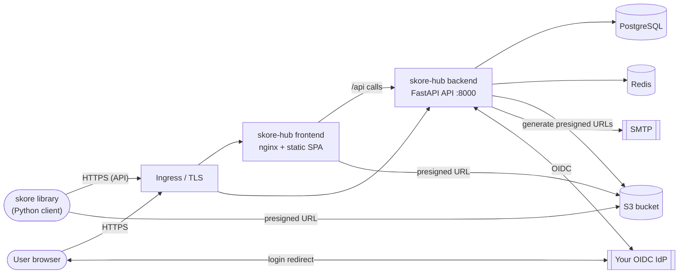

# skore-hub: On-premise deployment guide

This guide describes how to deploy and operate the **skore-hub** platform (backend API + frontend) on your own Kubernetes cluster.

It is written for an infrastructure/platform team that already operates Kubernetes. It focuses on **what skore-hub needs** and **how to wire it to your existing services**; it does not teach Kubernetes itself.

The guide is split into five documents:

- **This overview**: what you deploy, architecture, prerequisites, and the deployment order.
- **[Installation](01-installation.md)**: images, external services, OIDC, secrets, backend, frontend, ingress.
- **[Operations](02-operations.md)**: verification, observability/logging, troubleshooting.
- **[Agent setup](03-agent-setup.md)**: enabling and onboarding the Skore agent (LLM orchestration).
- **[Configuration reference](reference-configuration.md)**: every `SKH__*` setting.

> [!NOTE]
> **Skore agent: air-gapped notice.** The Skore agent (hub-side LLM orchestration) only supports **Anthropic** (SaaS) and **AWS Bedrock** as LLM backends. A deployment with no outbound access to either is **not supported** in this version. See [Agent setup](03-agent-setup.md).

## Contents

- [What you deploy](#what-you-deploy)
- [What you provide (bring your own)](#what-you-provide-bring-your-own)
- [Architecture](#architecture)
- [Prerequisites](#prerequisites)
- [Deployment steps](#deployment-steps-overview)
- [Conventions](#conventions)

## What you deploy

| Component | Delivery |
| --- | --- |
| **Backend API** | Container image (Scaleway registry) + Helm chart `skore-hub-backend` |
| **Frontend** | Container image (nginx serving static assets) + Helm chart `skore-hub-frontend` |

## What you provide (bring your own)

skore-hub connects to services that **you operate**:

- **PostgreSQL** database
- **Redis**
- **S3-compatible object storage** (bucket)
- **SMTP** server (transactional email)
- **OIDC identity provider** (your IdP) for authentication

Deploying and hardening those services is out of scope. This guide explains **how to configure skore-hub to connect to them**. See [External services](01-installation.md#external-services) and [OIDC](01-installation.md#oidc-identity-provider).

## Architecture

- **Two clients** talk to skore-hub:
  - the **web UI**, a user's **browser** loading the frontend SPA, which calls the backend API;
  - the **skore Python library**, used from users' environments, which calls the backend API directly.
- The **backend** is a stateless FastAPI app on port `8000`. State lives in PostgreSQL (relational data), Redis (token/cache), and S3 (artifacts/objects).
- **Object transfers use presigned URLs**: the backend generates short-lived presigned URLs, and clients (the browser/frontend and the skore library) then read/write objects **directly** on S3. The S3 endpoint must therefore be reachable from the clients, not only from the backend (see [External services](01-installation.md#external-services)).
- **Authentication** uses standard **OpenID Connect**: the browser is redirected to your IdP, and the backend validates tokens and reads the user profile from the IdP's `userinfo` endpoint. See [OIDC](01-installation.md#oidc-identity-provider).
- **Logs** are written to **stdout** (see [Observability and logging](02-operations.md#observability-and-logging)).
- Database schema is created/updated by an **Alembic migration Job** run automatically on every Helm install/upgrade.

## Prerequisites

### Kubernetes cluster

- A Kubernetes cluster, **v1.24+** (tested up to 1.36). The chart adapts the `Ingress` API version to the cluster version automatically.
- Permissions to create, in a dedicated namespace: `Deployment`, `Service`, `Ingress`, `Job`, `Secret`, `ServiceAccount` and `HorizontalPodAutoscaler`.
- An **Ingress controller** (e.g. ingress-nginx) if you expose the app over HTTP(S).
- A mechanism to obtain **TLS certificates** (cert-manager, corporate PKI, or manually managed `kubernetes.io/tls` secrets).

### Client tooling

On the workstation performing the deployment:

- `kubectl` matching your cluster version.
- `helm` **v3.8+** (v4 also works).
- Network access to the **Scaleway container registry** (`rg.fr-par.scw.cloud`) to pull images, or a mirror into your internal registry (see [Images and registry](01-installation.md#images-and-registry)).

### Backing services (bring your own)

The following must be reachable **from the cluster network** before deploying:

| Service | Version / notes |
| --- | --- |
| PostgreSQL | 14+ recommended (we run 18). One database + credentials for skore-hub. TLS optional. |
| Redis | 6+ recommended (we run 7.2). Standalone or cluster. TLS/auth optional. |
| S3-compatible storage | A bucket + access/secret keys. Path-style or virtual-host. Google Cloud Storage is supported via its S3 interoperability API (HMAC keys) — see [GCS via S3 interoperability](reference-configuration.md#gcs-via-s3-interoperability). |
| SMTP | Host/port + optional credentials and STARTTLS/TLS. |
| OIDC IdP | Must expose `/.well-known/openid-configuration`, an authorization code flow, a token endpoint and a `userinfo` endpoint. See [OIDC](01-installation.md#oidc-identity-provider). |

Sizing and connection details are covered in [External services](01-installation.md#external-services).

### Network requirements

Outbound connectivity **from the backend pods** to:

- PostgreSQL, Redis, S3 endpoint, SMTP server, and the OIDC IdP (token and userinfo endpoints).

Inbound connectivity:

- From user browsers to the **Ingress** (frontend + backend).
- Redirects between the browser and the **OIDC IdP** authorization endpoint.

### Provided by Probabl

Probabl provides you with:

- **Scaleway registry credentials** (username/password) to pull the images.
- The **image references** (repository and tag) for the backend and the frontend.

### Information to collect before you start

Have these ready. You will need them for configuration and the OIDC client registration:

- Public URLs (FQDNs) for the **frontend** and the **backend API**.
- PostgreSQL host/port/database/user/password (+ CA cert if TLS).
- Redis host/port (+ password/TLS if used).
- S3 endpoint, bucket name, region (if applicable), access key, secret key.
- SMTP host/port, credentials, sender address, TLS mode.
- OIDC issuer URL, and the ability to **register a new confidential client**.

## Deployment steps (overview)

1. [Prerequisites](#prerequisites): cluster, tooling, network.
2. [Images and registry](01-installation.md#images-and-registry): pull from Scaleway.
3. [External services](01-installation.md#external-services): Postgres, Redis, S3, SMTP.
4. [OIDC](01-installation.md#oidc-identity-provider): register the client in your IdP.
5. [Secrets](01-installation.md#secrets): create the application Secret.
6. [Install the backend](01-installation.md#install-the-backend): Helm, migrations.
7. [Frontend](01-installation.md#frontend): deploy and wire to the backend.
8. [Ingress, TLS, DNS](01-installation.md#ingress-tls-and-dns).
9. [Observability and logging](02-operations.md#observability-and-logging).
10. [Verification and smoke tests](02-operations.md#verification-and-smoke-tests).
11. [Troubleshooting](02-operations.md#troubleshooting).
12. [Agent setup](03-agent-setup.md) (optional): enable the Skore agent and onboard harnesses.

Reference:

- [Configuration reference](reference-configuration.md): every `SKH__*` setting.

## Conventions

- The backend is configured through **environment variables** prefixed with `SKH__`, using `__` as the nesting delimiter (e.g. `SKH__DB__HOST` maps to the `db.host` setting).
- Examples use the namespace `skore-hub` and the release name `skore-hub`. Adapt freely.
